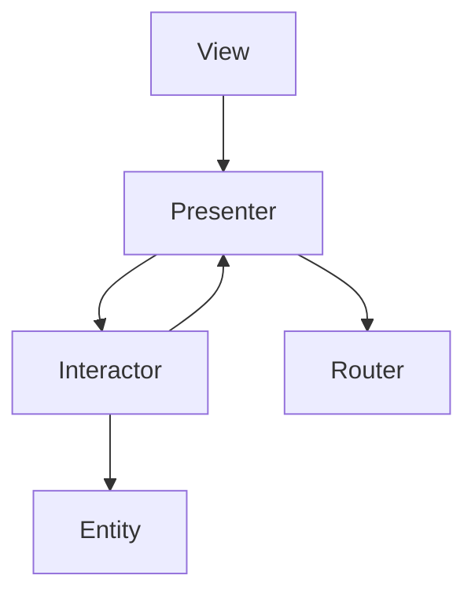

# stationclub

Welcome to the ios-stationclub repository! This repository contains the source code for the iOS application of stationclub, a social networking platform for podcast and radio enthusiasts. With stationclub, users can discover new podcasts and radio stations, connect with other enthusiasts, and share their favorite shows and episodes.

<br>
<br>

## Features

- [x] Browse and search for podcasts and radio stations.
- [ ] Follow podcasters and discover new shows and stations.
- [ ] Live chat on shows and episodes.
- [ ] Discover popular and trending podcasts and radio stations.
- [ ] Customize your profile and view other users' profiles.
- [ ] Send gifts to the podcast and join live voice discussions on air.
- [ ] Receive notifications for new followers, likes, and comments.
- [ ] Many will follow...

<br>
<br>

## Screenshots

| Splash | Onboarding | Landing | Sign in |
| --- | --- | --- | --- |
|  |  |  |  |

<br>
<br>

## Architecture

I've used `viper` architecture because it promotes a clear separation of concerns, allowing for easier maintenance and testing of individual components. `viper`'s modular approach enables scalability, making it simple to add new features or make changes without impacting the entire codebase. Additionally, The architecture emphasis on protocol-oriented programming enhances code reusability.


<br>
<br>

## Installation

To install and run the ios-stationclub application, follow these steps:

1. Clone the repository:
```bash
git clone https://github.com/sala7khaled/ios-stationclub.git
```
2. Open the project in Xcode.
3. Once the project is opened in Xcode.
4. Build and run the project using the simulator or a connected device.

<br>
<br>

## Dependencies

The ios-stationclub repository required no dependencies. I don't manage to add any third-party libraries so far, only native `swift` code.

<br>
<br>

## Contributing

Contributions to the ios-stationclub repository are welcome! If you would like to contribute, please follow these steps:

1. Fork the repository.
2. Create a new branch for your feature or bug fix:
```bash
git checkout -b feature/my-feature
```
3. Make your changes and commit them with descriptive commit messages.
4. Push your changes to your forked repository.
5. Submit a pull request to the `main` branch of the original repository.

Please ensure that your code follows the existing code style and conventions.

<br>
<br>

## License

The ios-stationclub repository is released under the [MIT License](LICENSE).

<br>
<br>

## Contact

If you have any questions or suggestions regarding the ios-stationclub application, please feel free to contact the project maintainer:

- Name: [Salah Khaled](Https://www.linkedin.com/in/sala7khaled/)
- Email: sala7khalad@gmail.com
- Website: [linktree/sala7khaled](https://linktr.ee/sala7khaled)

<br>
<br>

## Conclusion

I will be happy to answer any questions that you may have on this approach, please feel free to submit an issue and/or pull request.
If you liked my work, don’t forget to ⭐ star the repo to show your support.
